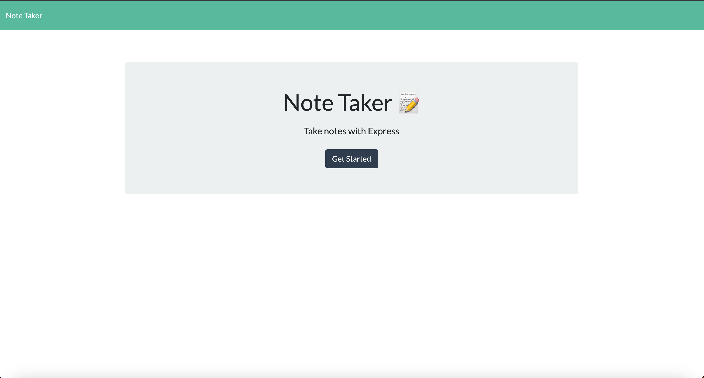
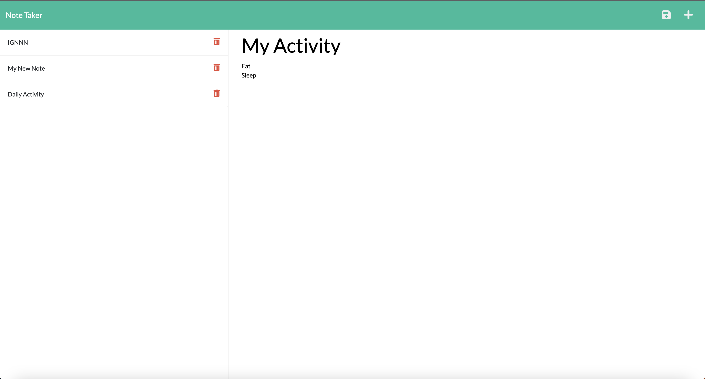

# Note-Taker
## Description 
Note Taker is a web-based application that allows users to create, view, and manage notes. The application provides a simple and user-friendly interface for users to write, save, and delete notes. It is built using Node.js, Express.js, and HTML/CSS, making it easy to deploy and use.

## Table of Contents
            
* [Installation](#installation)
* [Usage](#usage)
* [Deployed-Application-URL](#deployed-application-url)
* [Mock-Up](#mock-up)
* [Contributing](#contributing)
* [Question](#question)
            
## Installation
Run the following commend for installation.

npm i
            
## Usage 
Clone the repo and run the application with installation instruction.

## Deployed-Application-URL
[https://enigmatic-retreat-24327-db0de0ee7a05.herokuapp.com/]
        
## Mock-Up
The following image show how the application should be look like when you are running.

## Contributing
Fork the repo and copy it into your GitHub.
                 
## Question
If you have any questions about this repo, contact me directly at ahkarhein04@gmail.com. You can find more my work at (https://github.com/ahkar-hein)